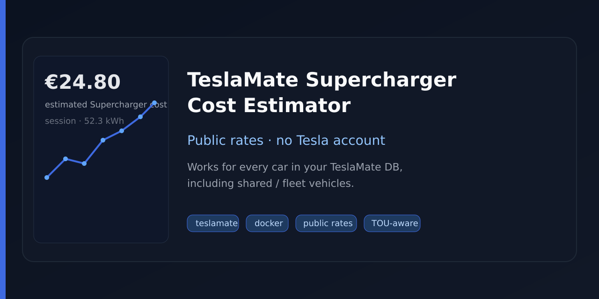

# TeslaMate Supercharger Cost Estimator

[](https://github.com/TUNER88/teslamate-supercharger-cost-estimator/actions/workflows/ci.yml)
[](https://github.com/TUNER88/teslamate-supercharger-cost-estimator/releases/latest)
[](LICENSE)
[](https://www.python.org/downloads/)



Fill Supercharger costs in [TeslaMate](https://github.com/teslamate-org/teslamate) from **public** station tariffs — **no Tesla account or refresh token**.

Useful when you run TeslaMate for one or more cars (including shared / fleet vehicles) and want approximate Supercharger spend in Grafana without importing Tesla invoices.

> **Estimates only.** Costs are derived from published €/kWh rates and session energy. They will not always match Tesla’s billed invoice (idle fees, memberships, credits, and local promotions are out of scope).

## Features

- No Tesla login — rates from [SuC Tracker](https://suc-tracker.eu/) public Europe feed
- Works for **every car** in your TeslaMate database (not only cars you “own” in the Tesla app)
- Matches **DC / Supercharger-like** sessions to nearby stations (~400 m) and writes `charging_processes.cost`
- Always ignores AC home/destination charging (TeslaMate `charger_phases` rule) — no config needed
- Respects time-of-use (TOU) windows; sessions that cross a rate change are skipped by default
- Runs as a long-lived Docker service (hourly by default) or as a one-shot / cron job
- Optional dry-run before writing

## Requirements

- A working [TeslaMate](https://github.com/teslamate-org/teslamate) stack (Docker Compose is the usual setup)
- Network access from the estimator container to TeslaMate Postgres and to the public rates URL
- Python 3.11+ if you run from source

## Quick start (Docker Compose)

Image: `ghcr.io/tuner88/teslamate-supercharger-cost-estimator:0.4.2`  
(`:latest`, `:0.4`, and `sha-…` tags are also published.)

1. Create a cache directory next to your TeslaMate compose file:

```bash
mkdir -p suc-estimator-cache
```

2. Add this service alongside your existing `database` service (full copy in [`deploy/docker-compose.snippet.yml`](deploy/docker-compose.snippet.yml)):

```yaml
  suc-estimator:
    image: ghcr.io/tuner88/teslamate-supercharger-cost-estimator:0.4.2
    container_name: teslamate-suc-estimator
    restart: always
    depends_on:
      - database
    environment:
      - DATABASE_PASS=${DATABASE_PASS}
    volumes:
      - ./suc-estimator-cache:/cache
```

`DATABASE_PASS` must match TeslaMate Postgres. Everything else has defaults (`UPDATE_INTERVAL_SECONDS=3600`, host `database`, and so on).

3. Start it:

```bash
docker compose pull suc-estimator
docker compose up -d suc-estimator
docker compose logs -f suc-estimator
```

Preview without writing:

```bash
docker compose run --rm -e DRY_RUN=true -e UPDATE_INTERVAL_SECONDS=0 suc-estimator
```

If `docker pull` returns `unauthorized`, the GHCR package may still be private — set the package visibility to **Public** under the repo’s Packages settings, or `docker login ghcr.io` with a token that can read packages.

### One-shot / cron

To run once instead of looping, set `UPDATE_INTERVAL_SECONDS=0` (and usually `restart: "no"`):

```cron
0 6,18 * * * cd /path/to/teslamate && docker compose run --rm -e UPDATE_INTERVAL_SECONDS=0 suc-estimator
```

## How it works

1. Download and cache Europe Supercharger tariffs from SuC Tracker.
2. Load finished TeslaMate charging sessions with `cost IS NULL` (unless overwrite is enabled).
3. Classify each session as AC or DC (TeslaMate Grafana rule on `charges.charger_phases`); **always skip AC** before matching.
4. Match each remaining (DC) session to the nearest priced station within about 400 m.
5. Select the TOU €/kWh window for the **session start** in the station timezone.
6. Write `cost = energy_kWh × rate` (larger of used / added energy).

Sessions that start in one TOU window and end in another are **skipped by default**. Set `ALLOW_CROSS_TOU=true` to price the whole session at the start-window rate instead.

Feed prices are stored as micro-units (for example `420000` → `0.42 EUR/kWh`).

### Per-minute, power-tiered tariffs

Some stations (e.g. Innsbruck, Bregenz) publish **per-minute, power-tiered** tariffs instead of €/kWh. They are matched and estimated too: the session's average power (`energy / duration`) selects the published power bracket, and `cost = minutes × tier rate`. Since only the average is known — not the power curve — this is an approximation, and the log line shows the average power used (e.g. `45 min × 0.6200 EUR/min @ 73 kW avg`).

Price integers in the public feed are **micro-units** here as well (e.g. `420000` → `0.42 EUR/min` for a per-minute tier).

### Estimate vs Tesla invoice

|| This project | Invoice importers |
|--|--------------|-------------------|
| Tesla account | Not required | Required |
| Shared / fleet cars in TeslaMate | Supported | Only if you can access that account’s invoices |
| Source | Public station tariffs | Tesla invoices |
| Idle / congestion fees | Not included | Usually included when billed |
| Membership / credits | Published owner tariff | Exact billed amount |
| Accuracy | Approximation | Exact |

Home / destination charging should stay on tools like [TeslaMateAgile](https://github.com/MattJeanes/TeslaMateAgile) or TeslaMate geofence costs — this project only considers **DC / Supercharger-like** sessions (AC is ignored automatically) near known stations.

## Configuration

| Variable | Required | Default | Meaning |
|----------|----------|---------|---------|
| `DATABASE_PASS` | **Yes** | — | Postgres password (`DATABASE_PASSWORD` also accepted) |
| `DATABASE_HOST` | No | `database` | Postgres hostname |
| `DATABASE_PORT` | No | `5432` | Postgres port |
| `DATABASE_NAME` | No | `teslamate` | Database name |
| `DATABASE_USER` | No | `teslamate` | Database user |
| `PRICE_SOURCE_URL` | No | `https://suc-tracker.eu/data/europe.json` | Public rates JSON |
| `PRICING_FAMILY` | No | `tesla` | `tesla` or `nonTesla` |
| `MATCH_RADIUS_M` | No | `400` | Max match distance (metres) |
| `LOOKBACK_DAYS` | No | `90` | How far back to scan |
| `OVERWRITE_EXISTING` | No | `false` | Also rewrite rows that already have a cost |
| `ALLOW_CROSS_TOU` | No | `false` | Allow sessions that cross a TOU boundary (priced at start rate) |
| `DRY_RUN` | No | `false` | Log estimates without writing |
| `UPDATE_INTERVAL_SECONDS` | No | `3600` | Loop interval; `0` = run once and exit |
| `CACHE_DIR` | No | `/cache` | Rate cache directory |
| `CACHE_TTL_SECONDS` | No | `43200` | Cache lifetime (12 hours) |

CLI flags map to the same options (`--dry-run`, `--update-interval-seconds`, `--lookback-days`, …).

## Build from source

```bash
git clone https://github.com/TUNER88/teslamate-supercharger-cost-estimator.git
cd teslamate-supercharger-cost-estimator
python -m venv .venv && source .venv/bin/activate
pip install -e ".[dev]"
pytest
suc-estimator --help
```

Or point Compose at a local build: `build: ./teslamate-supercharger-cost-estimator` instead of `image:`.

## Limitations

- Energy-only estimates (no idle / congestion fees).
- Coverage follows the SuC Tracker Europe feed (strong in Europe; incomplete elsewhere).
- Sessions without usable coordinates cannot be matched.
- Per-minute tariff estimates use the session's **average** power, not the real power curve — matches a real Innsbruck session to its correct bracket, but a session split across brackets is priced at the average bracket's rate.
- Only DC / Supercharger-like sessions are considered; AC home/destination charging is skipped automatically (no config). Home costs stay on Agile or geofence settings.
- Not a billing or tax tool — treat values as approximate.

## Contributing

Issues and pull requests are welcome.

1. Fork and branch from `main`
2. Open a PR
3. Wait for CI (`test`) to pass

Please update [`CHANGELOG.md`](CHANGELOG.md) for user-facing changes. Releases are tagged from the `version` in [`pyproject.toml`](pyproject.toml); see the changelog for history.

## Credits

- [TeslaMate](https://github.com/teslamate-org/teslamate) — vehicle and charging data
- [SuC Tracker](https://suc-tracker.eu/) — public Supercharger tariff data
- [TeslaMateAgile](https://github.com/MattJeanes/TeslaMateAgile) — inspiration for always-on cost updates in TeslaMate

## License

[MIT](LICENSE)
